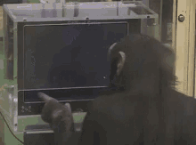

# Color Memory Game

This Arduino sketch implements a color memory game using LEDs, buttons, a buzzer, and an LCD with I2C. In this game, players must remember and repeat increasingly longer sequences of LED colors. The game provides visual, auditory, and textual feedback to the player throughout the gameplay.

## Features

- Generates random sequences of LED colors for players to remember.
- Uses buttons for player input to repeat the sequences.
- Provides sound effects using a buzzer for enhanced gameplay experience.
- Displays the current level on an LCD screen using I2C communication.

## Components Used

- LEDs: Used to represent colors in the game sequence.
- Buttons: Players press buttons corresponding to the LEDs to repeat the sequence.
- Buzzer: Provides sound effects, such as the Pirates of the Caribbean theme and game over melody.
- LCD with I2C: Displays the current level of the game.

## Circuit Diagram

## Setup

1. Connect LEDs, buttons, buzzer, and LCD to your Arduino board according to the pin assignments defined in the code.
2. Upload the provided Arduino sketch (`color_memory_game.ino`) to your Arduino board using the Arduino IDE or any compatible IDE.
3. Power up your Arduino board and start playing the color memory game!

## Usage

- When the game starts, LEDs will light up in a sequence. Remember the sequence.
- Press the corresponding buttons to repeat the sequence.
- If you repeat the sequence correctly, the level will increase, and the game will become more challenging.
- If you make a mistake, the game will end, and you can start over automatically.

## Contributors

- [Abdelghani Yacine BARKA](https://github.com/decodevm)
- [Nardjes Sara KHIAT](https://github.com/Nardjes03)

## Contributing

Contributions to this color memory game project are welcome! If you have any ideas for improvements or new features, feel free to open an issue or submit a pull request.

## Footer

This README provides an overview of the third TP (Travaux Pratiques) assignment for the ARDUINO course in the Master 1 Software Engineering program at the University of Tlemcen, during the 2023/2024 academic year.

## License

This project is licensed under the MIT License - see the [LICENSE](LICENSE) file for details.