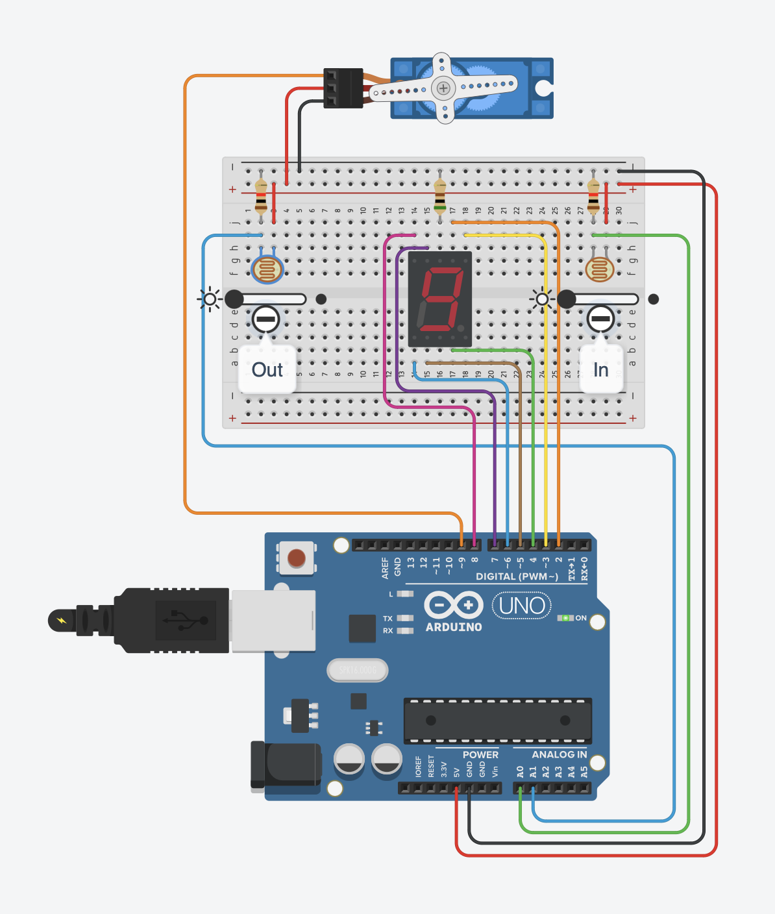

# Smart Parking System

## Overview

The Smart Parking System project aims to automate parking space management using Arduino technology. This system incorporates an LDR (Light Dependent Resistor) sensor, a servo motor, and a 7-segment display to detect vehicle presence, control parking barriers, and display parking space availability in real-time.

## Features

- **Vehicle Detection:** The LDR sensor detects the presence of vehicles entering or leaving parking spaces.
- **Automated Barrier Control:** The servo motor automatically opens and closes parking barriers based on vehicle presence.
- **Real-time Status Display:** A 7-segment display provides visual feedback on parking space availability.
- **User-friendly Interface:** The system offers a convenient interface for efficient parking space management.

## Components Used

- Arduino board (e.g., Arduino Uno)
- LDR sensor
- Servo motor
- 7-segment display
- Jumper wires
- Breadboard

## How it Works

1. **Vehicle Detection:** The LDR sensor detects changes in light intensity caused by vehicles entering or leaving parking spaces.
2. **Barrier Control:** The Arduino board processes the sensor data and commands the servo motor to open or close the parking barrier accordingly.
3. **Status Display:** Simultaneously, the Arduino updates the status of the parking space on the 7-segment display, indicating whether it is vacant or occupied.
4. **User Interaction:** Users can easily identify available parking spaces based on the displayed information and proceed with parking.

## Circuit Diagram

## Getting Started

1. **Assembly:** Connect the LDR sensor, servo motor, and 7-segment display to the Arduino board following the circuit diagram.
2. **Code Upload:** Upload the provided Arduino sketch to the board using the Arduino IDE.
3. **Power On:** Power the Arduino board and observe the Smart Parking System in action.

## Footer

This README provides an overview of the third TP (Travaux Pratiques) assignment for the ARDUINO course in the Master 1 Software Engineering program at the University of Tlemcen, during the 2023/2024 academic year.

## Contributors

- [Abdelghani Yacine BARKA](https://github.com/decodevm)
- [Tarik HAMMOUMI](https://github.com/ItsTarikBTW)
- [Mohammed Lhadi DIB](https://github.com/Lhadidib07)
- [Nardjes Sara KHIAT](https://github.com/Nardjes03)

## Contributions

Contributions to this project are welcome! If you'd like to make enhancements or report issues, please open a new issue or pull request.

